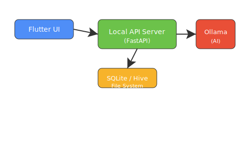

# Tech Stack

### Frontend

- Flutter (for cross-platform desktop UI)
- Dart (main UI logic)

### Data Storage & Logic

- SQLite (for structured data storage, fast search, and relationships)
- Hive (for app logic, state management, and lightweight key-value storage)
- File system access for local file storage (notes, attachments, exports)

### Backend & Agent Orchestration

- FastAPI (Python, for local backend processes and AI integration)
- Project File Scanner & Indexer (Python): Scans and indexes all project files for agent use
- Agent Orchestrator (Python): Manages agent tasks, context, and communication with Ollama

### AI Integration

- Ollama (local LLM runner for AI-powered suggestions and agent reasoning)
